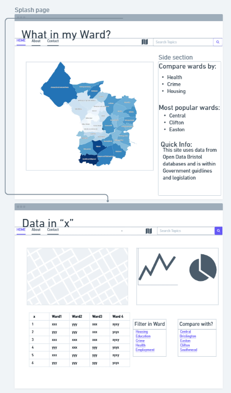

# Design
## UI Overview
It uses a multi-page web application interface, in which users have to enter their input (role, ward, and tags) progressively until they can visualize the data generated based on the inputs provided. The design separates input collection from data visualisation, improving clarity and usability.
## Individual Screen Designs
### Screen 1 — Role Selection (Page 1)

This screen allows the user to select their role (Resident, Mover, Business, Guest). This choice initialises the system state and influences later filtering options. The interface is minimal to ensure quick decision-making.
### Screen 2 — Ward Selection (Page 2)

This screen provides an interactive map and search bar, allowing users to select a ward visually or via text input. The design prioritises accessibility by offering both graphical and textual interaction methods.
### Screen 3 — Tag Selection (Page 3/4)

This interface allows users to select data categories (tags). Suggested tags are influenced by the selected role, improving relevance and reducing cognitive load.
### Screen 4 — Ranked Data View (Page 5)

This screen displays comparative graphs across all wards based on selected tags. The design supports users who want a broad overview without selecting a specific location.
### Screen 5 — Final Data View (Page 7)

This screen presents detailed, ward-specific data using graphs. It represents the primary output of the system and is designed for clarity and data interpretation.
### Screen 6 — Search Results (Page 6)

This screen displays ranked ward results based on keyword input. It provides an alternative interaction path, demonstrating flexibility in user navigation.

## User Interface design
TODO: Specify and develop a user interface mockup using a wireframe.

### Primary Flow (Main System Path)
The primary flow begins with role selection (Page 1), followed by ward selection (Page 2), tag selection (Page 4), and finally data visualisation (Page 7). This flow supports the main use case of viewing ward-specific data.
### Alternative Flow (Ranking Path)
An alternative path allows users to select tags without choosing a ward (Page 3), leading to Page 5 where all wards are ranked based on selected criteria.
### Search Flow
Users can also enter keywords via the search bar, which redirects to Page 6. From there, they can select a ward and continue to Page 4 and Page 7.

![Insert your wireframe/wireflow here] 

TODO: repeat as necessary
