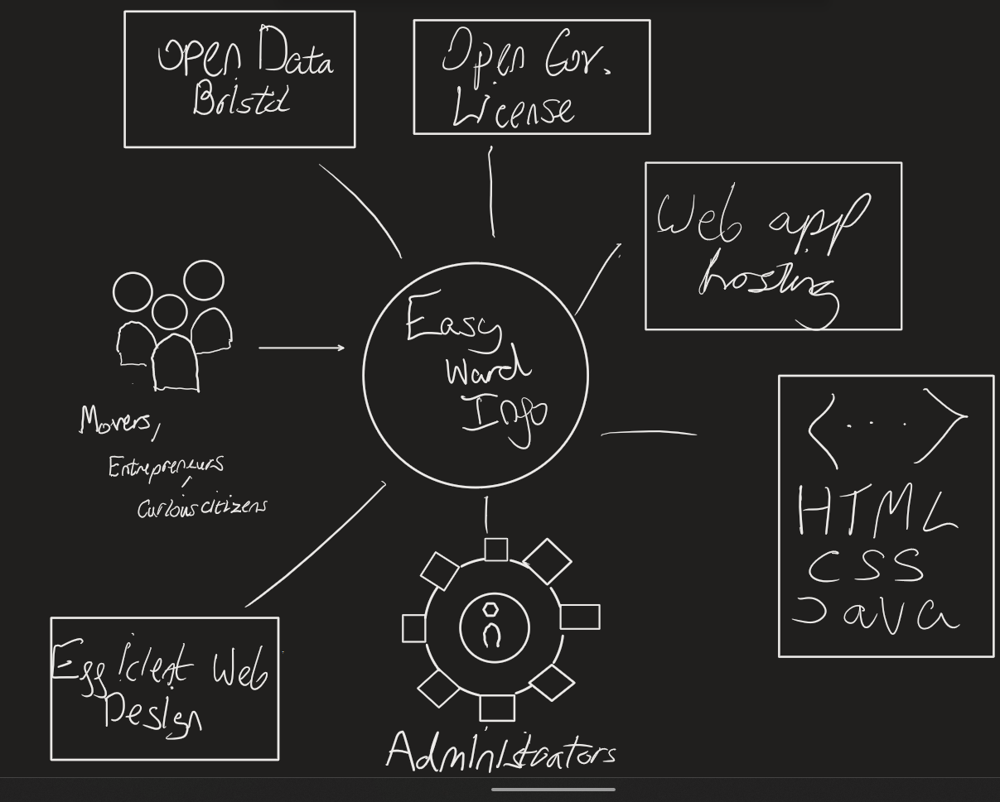

# Project Proposal

## Business Case

### Problem statement
If a person wants to move to Bristol, they will want to know more about their neighborhood in Bristol. Plus the propective Bristol entrepaneurs, together they all have a few things in common. Needing to filter, understand and evaluate information and data regarding to specific wards in Bristol.

### Business benefits
Open Data Bristol Hides accessible handy tools at the bottom of lists behind the last tab and other websites monitor and restrict this information behind a paywall. We want to bring a quick, free and effiecient tool into the mix; information such as crime rates, housing, health employment and more.

### Options Considered
Other Options such as crystalroof.co.uk has more information in all of the wards than we have accessible however they put these behind a premium paid service. Open Data Bristol uses Microsoft Power BI which is a great guideline and inspiration for our web app, Open Data Bristol puts this at the bottom of their "Data Dashboards" tab.

### Expected Risks
When competing with services like these the limitation on data when comparing various Bristol Open Data databases paired with beginner level knowledge compared to a funded Business that assumably localy sources their data and is able to create higher complexity zones and tools will potentially cast our project in a negative light due to the simplicity or any lack of features. However building a project without profit in mind will boost success.

## Project Scope
Things that are inside project scope:
 
  . Open Data Bristol
  . Open Gov license 
  . Web app hosting
  . HTML, CSS, Java
  . Administrators
  . Efficient Web design 
  . Movers, entrepreneurs, curious citizens 

